# 即见平台介绍与集成指南
> 为第三方团队提供的 Agentic AI 集成指南

---

## 第一部分：我们是什么

### 1.1 即见平台定位

**即见平台（CCAAS）**

- Agentic AI 基础设施平台
- 为第三方系统提供智能决策和自动化能力
- 类似 Infura 的角色：提供 AI 能力，不管业务数据

### 1.2 核心技术概念层级

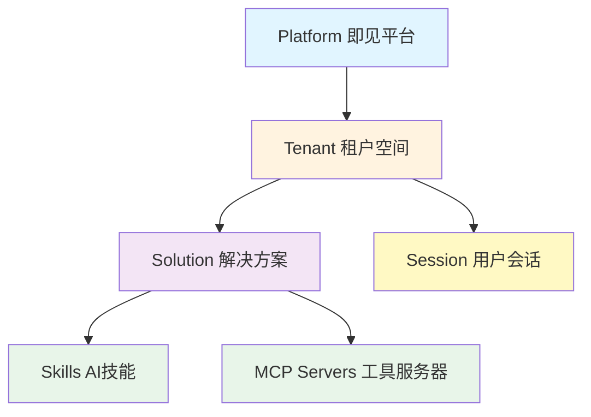

### 1.3 Tenant（租户）

**什么是 Tenant**：
- 您的独立工作空间
- 完全隔离的运行环境
- 独立的配置和权限管理

**Tenant 包含**：
- Solutions（一个或多个解决方案）
- API Keys 配置
- 用户和权限管理
- 资源配额

### 1.4 Solution（解决方案）

**Solution 定义**：
- 一个特定业务场景的 AI 能力包
- 由 Skills 和 MCP Servers 组成
- 可配置、可复用

**Solution 结构**：
```
Solution: 智能查询助手
├── Skills（AI 技能）
│   ├── 数据查询
│   ├── 结果分析
│   └── 报告生成
└── MCP Servers（工具）
    ├── 数据库 MCP（您的系统）
    ├── 知识库 MCP（您的系统）
    └── API MCP（您的系统）
```

### 1.5 最简单的对接方案

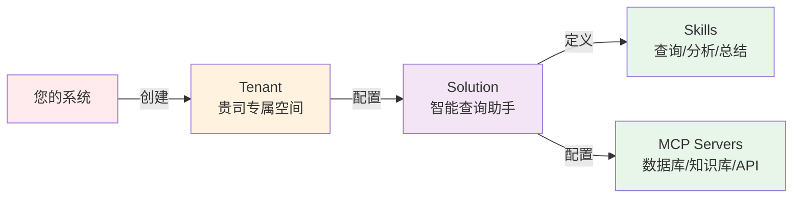

---

## 第二部分：GenAI vs Agentic AI

### 2.1 GenAI（传统生成式 AI）

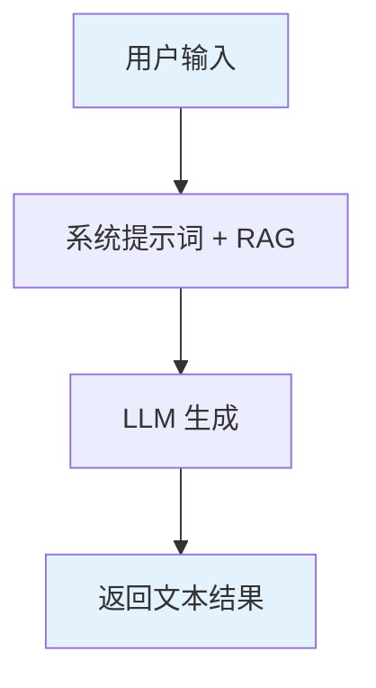

**特点**：
- ✅ 快速响应
- ✅ 简单直接
- ❌ 无法调用工具
- ❌ 无法多步推理
- ❌ 无法访问实时数据
- ❌ 功能扩展需要修改提示词

### 2.2 Agentic AI（即见平台）

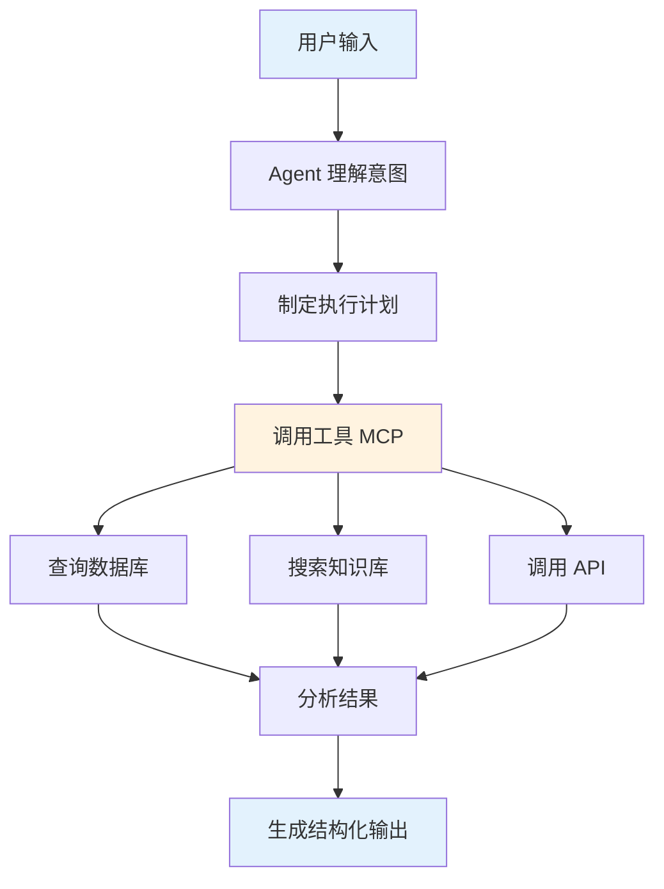

**特点**：
- ✅ 主动决策和规划
- ✅ 动态调用外部工具
- ✅ 多步骤推理和执行
- ✅ 访问实时数据
- ✅ 功能扩展无需改代码

### 2.3 对比案例

**场景**：用户问"最近三个月销售趋势如何？"

**GenAI 方式**：
1. LLM 根据提示词生成回答
2. ❌ 无法访问实际数据
3. 只能给出通用建议或虚构数据

**Agentic AI 方式**：
1. Agent 理解：需要查询真实销售数据
2. ✅ 调用数据库 MCP：`query_sales_data(startDate: "2024-11-01", endDate: "2025-02-01")`
3. ✅ 获取实际数据：[真实销售记录]
4. ✅ 分析趋势：计算增长率、识别模式
5. ✅ 生成可视化建议：图表类型、关键指标
6. ✅ 返回结构化报告：数据 + 分析 + 建议

### 2.4 产品逻辑的本质区别 ⭐

这不仅是技术上的区别，更是**用户体验和产品逻辑**的根本性差异。

#### GenAI：结果导向（黑盒模式）

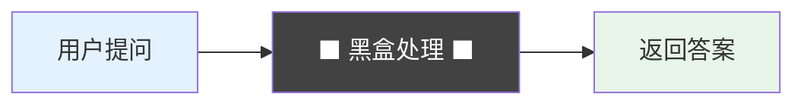

**用户心智模型**：
- 💭 "我不关心你怎么做的"
- 💭 "我只要结果"
- 💭 "就像搜索引擎一样，给我答案"

**产品设计**：
- 界面简洁：输入框 + 输出框
- 无过程展示
- 快速响应优先
- 用户评估维度：**答案是否正确**

**局限性**：
- ❌ 答案错了，不知道哪里出了问题
- ❌ 无法调试和优化
- ❌ 缺乏信任感（为什么这么说？）
- ❌ 无法参与决策过程

#### Agentic AI：过程导向（白盒模式）

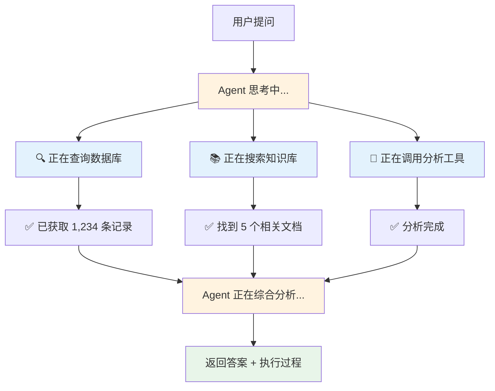

**用户心智模型**：
- 💭 "让我看看你是怎么做的"
- 💭 "每一步都要清楚"
- 💭 "我需要知道这个答案从哪里来"

**产品设计**：
- 实时进度展示
- 每个步骤可视化
- 工具调用日志
- 决策过程透明
- 用户评估维度：**执行逻辑是否合理**

**优势**：
- ✅ 可信任：看到了完整的推理过程
- ✅ 可调试：哪一步出问题，一目了然
- ✅ 可优化：用户可以介入和引导
- ✅ 可学习：理解 AI 如何解决问题

#### 对比示例：查询销售数据

| 维度 | GenAI 黑盒 | Agentic AI 白盒 |
|------|-----------|-----------------|
| **用户界面** | 只显示最终答案 | 显示执行过程 + 最终答案 |
| **过程可见性** | ❌ 不可见 | ✅ 实时展示每一步 |
| **错误定位** | ❌ 无法定位 | ✅ 精确到具体步骤 |
| **信任感** | ⚠️ 基于结果评估 | ✅ 基于过程评估 |
| **用户控制** | ❌ 无法干预 | ✅ 可在关键节点确认 |
| **学习价值** | ❌ 只知其然 | ✅ 知其所以然 |

**实际界面对比**：

**GenAI**：
```
用户："分析最近三个月销售趋势"
AI：  "根据数据显示，销售额呈上升趋势，增长率为15%..."
     （用户心里：这数据哪来的？可信吗？）
```

**Agentic AI**：
```
用户："分析最近三个月销售趋势"

[Agent 思考中...]
├─ 🔍 正在查询数据库...
├─ ✅ 已获取 2024-11-01 至 2025-02-01 销售记录（1,234 条）
├─ 📊 正在计算趋势...
├─ ✅ 11月销售额：¥1,250,000
├─ ✅ 12月销售额：¥1,380,000
├─ ✅ 01月销售额：¥1,450,000
├─ 📈 正在生成分析...
└─ ✅ 分析完成

AI："基于实际查询的 1,234 条销售记录，最近三个月销售额呈上升趋势：
     - 11月：¥125万
     - 12月：¥138万（环比 +10.4%）
     - 01月：¥145万（环比 +5.2%）
     整体增长率：15.2%"

（用户心里：清楚明白，数据来源可信，推理逻辑合理）
```

#### 即见平台的核心优势

通过 **Event 机制**，我们让 Agentic AI 的执行过程完全可观测：

- ⚡ **实时事件流**：每个操作都发送 Event
- 📡 **前端实时监听**：WebSocket 推送进度
- 🎯 **精确的状态追踪**：工具调用、思考、生成
- 🔧 **完整的调试信息**：错误发生在哪一步，参数是什么

**这就是为什么需要 Event 机制！**

### 2.5 目标：打通 Legacy 系统

**核心价值**：
- 让您的 Legacy 系统具备 AI 能力
- 无需重构现有系统
- 通过标准化接口（MCP）连接
- AI 成为智能助手层，业务逻辑不变

---

## 第三部分：我们怎么做

### 3.1 MCP（Model Context Protocol）- 纯粹的工具

#### MCP 的本质定位

**MCP = 工具（Tool）**，不包含业务逻辑

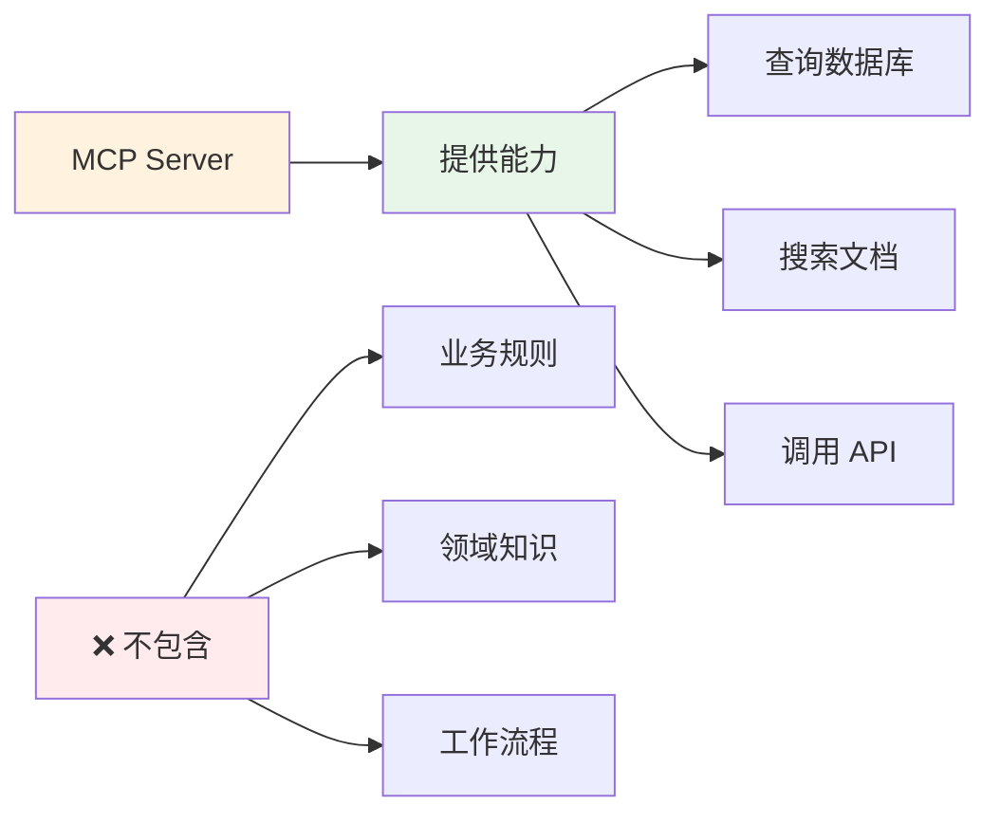

**类比**：
- MCP 就像**螺丝刀、锤子、扳手**
- 提供基础能力，但不知道如何使用
- 不懂业务场景，只执行具体操作

**什么是 MCP**：
- Model Context Protocol（模型上下文协议）
- 标准化的工具接口规范
- 让 AI Agent 可以调用外部能力
- **纯粹的能力层，无业务逻辑**

**对外接口标准**：
```typescript
interface MCPServer {
  name: string          // 服务器名称
  tools: Tool[]         // 您暴露的能力列表
}

interface Tool {
  name: string          // 工具名称
  description: string   // 功能描述（AI 据此决定何时调用）
  parameters: Schema    // 参数定义
  handler: Function     // 实现函数（您的代码）
}
```

**您需要提供**：
- 工具名称和清晰的描述
- 参数的结构定义
- 实现函数（handler）

**我们负责**：
- Agent 何时调用哪个工具
- 如何组合多个工具完成任务
- 如何使用工具返回的结果

### 3.2 MCP Server 示例

**场景**：暴露数据库查询能力

```typescript
{
  name: "database-query",
  tools: [
    {
      name: "query_sales_data",
      description: "查询销售数据（只读），支持日期范围和筛选条件",
      parameters: {
        type: "object",
        properties: {
          startDate: { type: "string", description: "开始日期 YYYY-MM-DD" },
          endDate: { type: "string", description: "结束日期 YYYY-MM-DD" },
          filters: { type: "object", description: "筛选条件（可选）" }
        },
        required: ["startDate", "endDate"]
      },
      handler: async (params) => {
        // 您的实现代码
        const { startDate, endDate, filters } = params

        // 构建安全的查询（防止 SQL 注入）
        const sql = buildSafeQuery(startDate, endDate, filters)

        // 执行查询（只读）
        const result = await yourDatabase.query(sql)

        // 返回结果
        return {
          success: true,
          data: result.rows,
          count: result.count
        }
      }
    },
    {
      name: "query_customer_info",
      description: "查询客户信息（只读）",
      parameters: {
        type: "object",
        properties: {
          customerId: { type: "string" }
        },
        required: ["customerId"]
      },
      handler: async (params) => {
        // 您的实现...
        return await yourCRM.getCustomer(params.customerId)
      }
    }
  ]
}
```

### 3.3 Skills 配置 - Domain Knowledge 驱动的业务逻辑

#### Skills 的本质定位

**Skills = Domain Knowledge（领域知识）+ 业务逻辑**

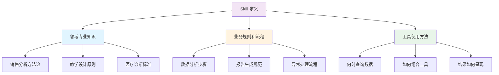

**类比**：
- MCP 是**工具箱**（螺丝刀、锤子）
- Skills 是**施工图纸 + 工匠经验**
  - 知道何时用哪个工具
  - 知道如何组合使用
  - 知道达到什么标准

**对比说明**：

| 维度 | MCP（工具） | Skills（专家知识） |
|------|-----------|------------------|
| **定位** | 提供能力 | 指导如何使用能力 |
| **包含内容** | 函数接口 | 领域知识 + 业务逻辑 |
| **举例** | `query_sales_data()` | "先查销售数据，然后按 MECE 原则分析" |
| **可复用性** | 跨场景复用 | 特定领域专用 |
| **专业性** | 技术实现 | 业务专家经验 |

**什么是 Skill**：
- 定义 AI 的专业角色和领域知识
- 封装业务规则和工作流程
- 指导 AI 如何使用 MCP 工具
- **Domain Knowledge 驱动的业务逻辑描述**

**Skill 配置示例**：
```yaml
name: 销售数据分析助手
slug: sales-analyzer
description: 分析销售数据并生成洞察报告

# 可用的 MCP 服务器
mcpServers:
  - database-query
  - knowledge-base

# AI 的系统提示词（Domain Knowledge + 业务逻辑）
prompt: |
  ## 角色定义（领域专家身份）
  你是一位专业的销售数据分析师，精通：
  - 销售漏斗分析方法
  - 客户细分理论（RFM 模型）
  - 趋势预测技术（移动平均、季节性分析）

  ## 可用工具（MCP 提供的能力）
  - query_sales_data: 查询销售数据
  - query_customer_info: 查询客户信息
  - search_knowledge: 搜索分析方法库

  ## 分析方法论（Domain Knowledge）

  ### 销售趋势分析标准流程：
  1. **数据收集**
     - 查询至少 3 个月的历史数据
     - 包含：订单量、销售额、客户数、转化率

  2. **数据清洗和验证**
     - 识别异常值（超过 3 倍标准差）
     - 处理缺失数据
     - 验证数据完整性

  3. **趋势分析**（应用专业方法）
     - 计算环比增长率（MoM）
     - 计算同比增长率（YoY）
     - 识别季节性模式
     - 应用移动平均平滑波动

  4. **客户细分**（RFM 模型）
     - Recency: 最近购买时间
     - Frequency: 购买频率
     - Monetary: 购买金额
     - 识别高价值客户群体

  5. **异常检测**
     - 突增/突降订单
     - 客户流失预警
     - 产品异常表现

  6. **洞察生成**
     - 关键发现（Top 3）
     - 数据支撑的结论
     - 可操作的建议

  ## 报告规范（业务规则）
  输出必须包含：
  1. 执行摘要（不超过 3 句话）
  2. 关键指标变化（数据 + 百分比）
  3. 趋势图表建议（柱状图/折线图/饼图）
  4. 异常说明（如有）
  5. 行动建议（3-5 条，SMART 原则）

  ## 重要约束
  - 基于真实数据，不要臆测
  - 引用数据来源（"基于 2024-11 至 2025-01 的 1,234 条记录"）
  - 提供置信度说明（数据量是否充足）
  - 你只能读取数据，所有建议需用户确认后执行
```

### 3.4 Session（会话机制）

#### 什么是 Session

**Session 定义**：
- 每个用户交互的独立会话空间
- 一次对话 = 一个 Session
- 完全隔离的执行环境

**Session 包含**：
- 独立的文件系统（Workspace）
- 对话历史和上下文
- 临时生成的文件
- Agent 执行状态

#### Session 生命周期

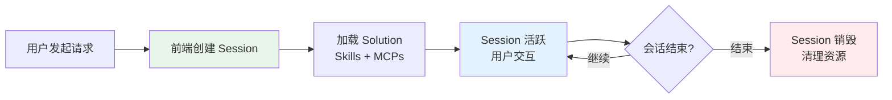

**各阶段说明**：

1. **创建阶段**
   - 前端调用 API 创建 Session
   - 指定使用的 Solution
   - 获得 Session ID

2. **活跃阶段**
   - 用户发送消息
   - Agent 执行任务
   - 调用 MCP 工具
   - 生成文件（如 PPT、报告）
   - 多轮对话交互

3. **销毁阶段**
   - 用户关闭会话
   - Session 超时（默认 1 小时无活动）
   - Workspace 文件清理
   - 资源释放

#### Session 文件系统（Workspace）

每个 Session 拥有独立的虚拟文件系统：

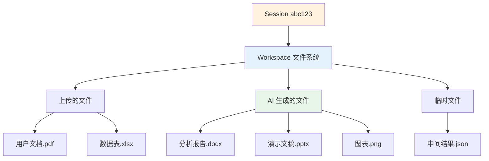

**Workspace 特性**：
- 路径：`/workspace/`
- 容量限制：默认 100MB
- 生命周期：与 Session 同步
- 隔离性：不同 Session 完全隔离
- 可访问性：用户可下载文件

#### 前端集成方式

**方式 1：REST API**

```typescript
// 1. 创建 Session
const response = await fetch('https://api.ccaas.platform/api/v1/sessions', {
  method: 'POST',
  headers: {
    'Authorization': 'Bearer YOUR_API_KEY',
    'Content-Type': 'application/json'
  },
  body: JSON.stringify({
    tenantId: 'your-tenant-id',
    solutionSlug: 'your-solution-slug'
  })
})

const { sessionId } = await response.json()

// 2. 发送消息
await fetch(`https://api.ccaas.platform/api/v1/sessions/${sessionId}/completion`, {
  method: 'POST',
  headers: {
    'Authorization': 'Bearer YOUR_API_KEY',
    'Content-Type': 'application/json'
  },
  body: JSON.stringify({
    messages: [
      { role: 'user', content: '分析最近三个月的销售数据' }
    ]
  })
})

// 3. 下载生成的文件
const fileUrl = `https://api.ccaas.platform/api/v1/sessions/${sessionId}/files/report.pdf`
```

**方式 2：React SDK（推荐）**

```tsx
import { useAgentConnection, useAgentChat } from '@kedge-agentic/react-sdk'

function MyApp() {
  // 自动管理 Session 生命周期
  const connection = useAgentConnection({
    serverUrl: 'https://api.ccaas.platform',
    sessionPrefix: 'sales-analyzer'
  })

  const chat = useAgentChat({
    connection,
    tenantId: 'your-tenant-id'
  })

  return (
    <div>
      <p>Session ID: {connection.sessionId}</p>
      <button onClick={() => chat.sendMessage('分析销售数据')}>
        发送消息
      </button>
    </div>
  )
}
```

**方式 3：Vue SDK（推荐）**

```vue
<script setup lang="ts">
import { useAgentChat } from '@kedge-agentic/vue-sdk'

// 自动管理 Session
const chat = useAgentChat({
  serverUrl: 'https://api.ccaas.platform',
  tenantId: 'your-tenant-id',
  solutionSlug: 'sales-analyzer'
})

const sendMessage = () => {
  chat.sendMessage('分析销售数据')
}
</script>

<template>
  <div>
    <p>Session ID: {{ chat.sessionId }}</p>
    <button @click="sendMessage">发送消息</button>
  </div>
</template>
```

#### Session 工作流程（完整）

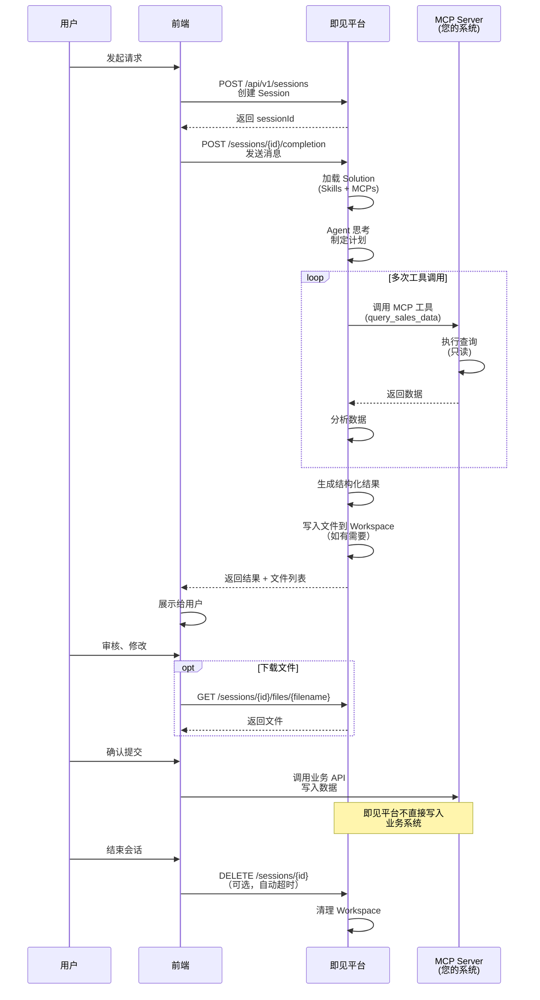

#### Session 最佳实践

**1. 会话管理**

```typescript
// ✅ 好的做法：一个用户任务 = 一个 Session
const session1 = await createSession({ solution: 'data-analyzer' })
// 用户完成分析后关闭
await closeSession(session1.id)

// ❌ 不好的做法：复用 Session 处理不同任务
const session = await createSession({ solution: 'data-analyzer' })
// 用于数据分析
await analyzeData(session.id, data1)
// 又用于生成报告（可能导致上下文混乱）
await generateReport(session.id, data2)
```

**2. 文件管理**

```typescript
// ✅ 下载重要文件
const files = await listSessionFiles(sessionId)
for (const file of files.filter(f => f.important)) {
  await downloadFile(sessionId, file.name)
}

// ✅ 及时清理 Session
await closeSession(sessionId)
```

**3. 错误处理**

```typescript
try {
  const session = await createSession(config)
} catch (error) {
  if (error.code === 'TENANT_QUOTA_EXCEEDED') {
    // 租户配额已满
    showError('当前并发会话数已达上限，请稍后重试')
  } else if (error.code === 'SOLUTION_NOT_FOUND') {
    // Solution 不存在
    showError('解决方案未找到，请检查配置')
  }
}
```

### 3.5 Event 机制（实时可观测性）⭐

#### 为什么需要 Event？

回顾第二部分的产品逻辑区别：
- **GenAI**：用户只关心结果（黑盒）
- **Agentic AI**：用户需要看到执行过程（白盒）

**即见平台的核心设计理念**：
> 通过实时 Event 流，让 AI 的每一步思考和执行都清晰可见，建立用户信任，实现真正的人机协作。

#### Event 的设计目的

**1. 建立信任**
```
用户心理路径：
看到执行过程 → 理解决策逻辑 → 信任结果 → 愿意采纳建议
```

**2. 精确调试**
```
问题定位：
哪一步失败了？ → 查看 Event 日志 → 定位到具体工具调用 → 检查参数和返回值
```

**3. 用户引导**
```
过程可控：
关键步骤 → 发送确认 Event → 用户决策 → 继续执行
```

**4. 产品体验**
```
流畅感知：
实时进度条 → 当前任务状态 → 预期完成时间 → 降低等待焦虑
```

#### Session 的 Event 类型

即见平台在 Session 执行过程中会发送以下 Event（通过 WebSocket 实时推送）：

##### 核心 Event 列表

| Event 名称 | 触发时机 | 包含信息 | 前端展示建议 |
|-----------|---------|---------|------------|
| `agent_status` | Agent 开始/完成/错误 | status, message | 整体状态指示器 |
| `agent_thinking` | Agent 正在思考 | thinkingContent | "正在思考..." 动画 |
| `tool_activity` | 工具调用开始/完成 | toolName, params, result, duration | 工具调用列表 |
| `text_delta` | 流式文本生成 | deltaText | 逐字显示效果 |
| `chat_message` | 完整消息 | role, content | 消息气泡 |
| `output_update` | 字段更新建议 | field, value, preview | 同步按钮 |
| `subagent_started` | 子 Agent 启动 | subAgentId, agentType, description | 子任务卡片 |
| `subagent_completed` | 子 Agent 完成 | subAgentId, result | 任务完成标记 |
| `todo_created` | 创建待办任务 | todoId, content, status | 任务列表 |
| `todo_updated` | 更新任务状态 | todoId, status | 任务进度 |
| `file_created` | 生成文件 | fileName, filePath, fileType | 文件下载链接 |

#### Event 数据结构示例

**1. agent_thinking（思考中）**

```json
{
  "type": "agent_thinking",
  "payload": {
    "sessionId": "sess_abc123",
    "thinkingContent": "用户想要分析销售数据，我需要：\n1. 查询数据库获取原始数据\n2. 计算趋势和增长率\n3. 生成可视化建议",
    "timestamp": "2025-02-09T10:30:15Z"
  }
}
```

**前端展示**：
```
💭 正在思考...
   用户想要分析销售数据，我需要：
   1. 查询数据库获取原始数据
   2. 计算趋势和增长率
   3. 生成可视化建议
```

**2. tool_activity（工具调用）**

```json
{
  "type": "tool_activity",
  "payload": {
    "activityId": "act_001",
    "toolName": "query_sales_data",
    "status": "running",
    "params": {
      "startDate": "2024-11-01",
      "endDate": "2025-02-01"
    },
    "startedAt": "2025-02-09T10:30:20Z"
  }
}
```

**前端展示**：
```
🔍 正在调用工具: query_sales_data
   参数:
   - startDate: 2024-11-01
   - endDate: 2025-02-01
   [进度条动画]
```

完成后的 Event：
```json
{
  "type": "tool_activity",
  "payload": {
    "activityId": "act_001",
    "toolName": "query_sales_data",
    "status": "completed",
    "result": {
      "count": 1234,
      "data": [/* 数据 */]
    },
    "duration": 850,
    "completedAt": "2025-02-09T10:30:21Z"
  }
}
```

**前端展示**：
```
✅ 工具调用完成: query_sales_data
   耗时: 850ms
   结果: 已获取 1,234 条销售记录
```

**3. subagent_started（子任务启动）**

```json
{
  "type": "subagent_started",
  "payload": {
    "subAgentId": "sub_001",
    "agentType": "DataAnalyzer",
    "description": "分析销售趋势",
    "status": "running",
    "startedAt": "2025-02-09T10:30:25Z"
  }
}
```

**前端展示**：
```
📊 启动子任务: 分析销售趋势
   类型: DataAnalyzer
   [子任务进度卡片]
```

**4. output_update（字段更新）**

```json
{
  "type": "output_update",
  "payload": {
    "field": "sales_summary",
    "value": "最近三个月销售额呈上升趋势，总体增长15.2%",
    "preview": "最近三个月销售额呈上升趋势...",
    "synced": false
  }
}
```

**前端展示**：
```
📝 AI 建议更新字段: sales_summary
   内容预览: "最近三个月销售额呈上升趋势..."
   [查看详情] [同步到表单] [忽略]
```

**5. todo_created（任务创建）**

```json
{
  "type": "todo_created",
  "payload": {
    "todoId": "todo_001",
    "content": "查询销售数据",
    "status": "completed",
    "metadata": {
      "activeForm": "查询中..."
    }
  }
}
```

**前端展示**：
```
任务列表：
  ✅ 查询销售数据
  ⏳ 分析趋势
  ⏳ 生成报告
```

#### 前端集成示例

**React SDK 监听 Event（通过 SSE）**

```tsx
import { useAgentConnection, useAgentStatus } from '@kedge-agentic/react-sdk'

function AgentMonitor() {
  const connection = useAgentConnection({ serverUrl: 'http://localhost:3001' })
  // useAgentStatus 内部通过 SSE 自动监听所有事件：
  // tool_activity、agent_thinking、subagent_started 等
  const status = useAgentStatus({ connection })

  return (
    <div className="agent-monitor">
      {/* 实时状态展示 */}
      {status.isThinking && (
        <div className="thinking-indicator">
          💭 正在思考...
          <p>{status.thinkingContent}</p>
        </div>
      )}

      {/* 工具调用列表 */}
      <div className="tool-activities">
        {Array.from(status.activeTools.values()).map(tool => (
          <div key={tool.activityId} className="tool-card">
            <span>{tool.status === 'running' ? '🔄' : '✅'}</span>
            {tool.toolName}
            <span className="duration">{tool.duration}ms</span>
          </div>
        ))}
      </div>

      {/* 子任务列表 */}
      <div className="subagents">
        {status.activeSubAgents.map(sub => (
          <div key={sub.subAgentId} className="subagent-card">
            📊 {sub.description}
            <span className="status">{sub.status}</span>
          </div>
        ))}
      </div>

      {/* 任务进度 */}
      {status.todoItems && (
        <div className="todos">
          <h4>任务进度</h4>
          {status.todoItems.map(todo => (
            <div key={todo.id} className="todo-item">
              <span>{todo.status === 'completed' ? '✅' : '⏳'}</span>
              {todo.content}
            </div>
          ))}
        </div>
      )}
    </div>
  )
}
```

**Vue SDK 监听 Event**

```vue
<script setup lang="ts">
import { useAgentState, useToolActivity, useTodoProgress } from '@kedge-agentic/vue-sdk'

const agentState = useAgentState()
const toolActivity = useToolActivity()
const todoProgress = useTodoProgress()
</script>

<template>
  <div class="agent-monitor">
    <!-- 思考状态 -->
    <div v-if="agentState.isThinking" class="thinking">
      💭 正在思考...
      <p>{{ agentState.thinkingContent }}</p>
    </div>

    <!-- 工具调用 -->
    <div class="tools">
      <div v-for="activity in toolActivity.recentActivities" :key="activity.id">
        {{ activity.isRunning ? '🔄' : '✅' }}
        {{ activity.toolName }}
        <span v-if="activity.duration">{{ activity.duration }}ms</span>
      </div>
    </div>

    <!-- 任务进度 -->
    <div v-if="todoProgress.hasTodos" class="todos">
      <h4>任务进度: {{ todoProgress.progress }}%</h4>
      <div v-for="todo in todoProgress.todoItems" :key="todo.id">
        {{ todo.status === 'completed' ? '✅' : '⏳' }}
        {{ todo.content }}
      </div>
    </div>
  </div>
</template>
```

#### UI 设计建议

**1. 整体布局**

```
┌─────────────────────────────────────────┐
│  用户输入框                               │
└─────────────────────────────────────────┘

┌─────────────────────────────────────────┐
│  💭 Agent 状态                           │
│  ┌────────────────────────────────────┐ │
│  │ 正在思考...                         │ │
│  │ 我需要查询数据库获取销售记录         │ │
│  └────────────────────────────────────┘ │
│                                          │
│  🔧 工具调用                             │
│  ┌────────────────────────────────────┐ │
│  │ ✅ query_sales_data (850ms)        │ │
│  │ 🔄 analyze_trend (运行中...)       │ │
│  └────────────────────────────────────┘ │
│                                          │
│  📊 子任务                               │
│  ┌────────────────────────────────────┐ │
│  │ DataAnalyzer - 分析销售趋势         │ │
│  │ [进度条 ████████░░ 80%]            │ │
│  └────────────────────────────────────┘ │
│                                          │
│  ✅ 任务列表                             │
│  ┌────────────────────────────────────┐ │
│  │ ✅ 查询销售数据                     │ │
│  │ ⏳ 分析趋势                         │ │
│  │ ⏳ 生成报告                         │ │
│  └────────────────────────────────────┘ │
└─────────────────────────────────────────┘

┌─────────────────────────────────────────┐
│  消息历史                                 │
└─────────────────────────────────────────┘
```

**2. 动画效果**

- 思考中：脉动动画
- 工具调用：进度条 + 计时器
- 完成状态：淡入动画 + 对勾
- 错误状态：抖动 + 红色高亮

**3. 交互设计**

- 点击工具卡片：展开详细参数和结果
- 点击子任务：查看子任务的 Event 流
- 悬停任务项：显示执行时间和详情

#### Event 的业务价值

**对用户**：
- ✅ 清楚知道 AI 在做什么
- ✅ 理解决策依据
- ✅ 可以中途干预
- ✅ 建立信任感

**对开发团队**：
- ✅ 精确的错误定位
- ✅ 完整的执行日志
- ✅ 性能分析数据
- ✅ 用户行为洞察

**对产品体验**：
- ✅ 降低等待焦虑
- ✅ 提升参与感
- ✅ 增强专业感
- ✅ 形成产品差异化

### 3.6 只读 MCP 模式

**核心设计原则**：MCP 只提供只读能力

**为什么只读**：

1. **安全性**
   - 避免 AI 误操作修改数据
   - 降低系统风险
   - 简化权限管理

2. **可控性**
   - 用户明确知道发生了什么
   - 最终决策权在用户手中
   - 符合人机协作原则

3. **可审计**
   - 所有写操作有明确记录
   - 用户操作可追溯
   - 便于合规审查

**数据流向**：
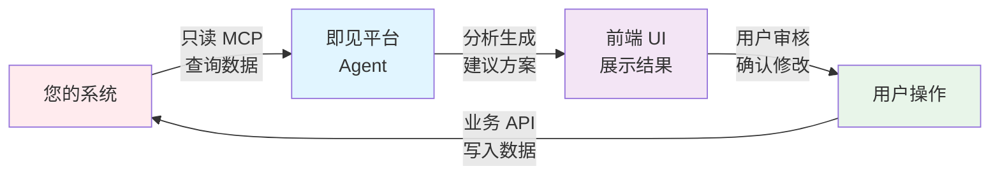

---

## 第四部分：集成架构

### 4.1 整体架构图

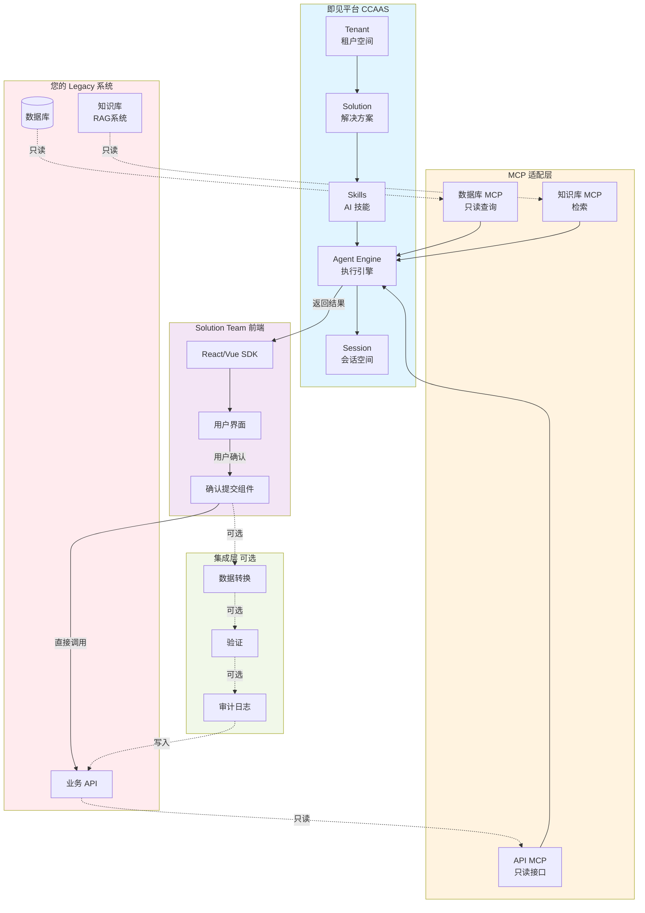

### 4.2 MCP 适配层

**挑战**：Legacy 系统可能是：
- 老旧技术栈（SOAP、老版本 REST）
- 异构系统（多个独立系统）
- 没有统一接口
- 无法直接暴露给 AI

**解决方案**：MCP Adapter

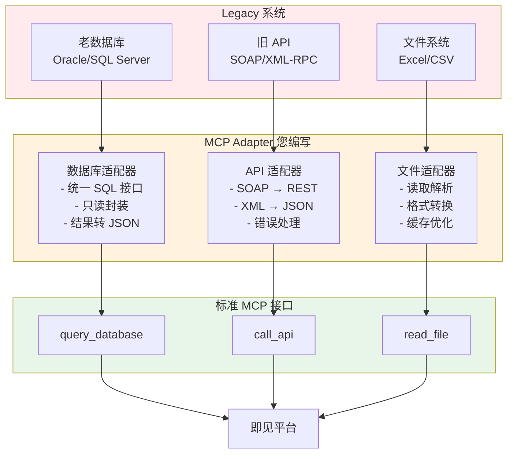

**关键点**：
- 您负责适配层开发
- 我们负责调用和编排
- Legacy 系统无需改动

### 4.3 三种集成方案

#### 方案 A：轻量集成（推荐）

```
[即见平台] ←─MCP(只读)─→ [您的系统]
     ↓
[前端展示 SDK]
     ↓
[用户确认提交] ──直接调用──→ [业务 API 写入]
```

**优点**：
- ✅ 解耦彻底，各自独立
- ✅ 安全可控，用户掌控
- ✅ 快速上线，改动最小

**适用**：
- 业务逻辑简单
- 数据验证简单
- 不需要复杂转换

#### 方案 B：集成平台（中型项目）

```
[即见平台] ←─MCP(只读)─→ [您的系统]
     ↓
[前端展示 SDK]
     ↓
[用户确认] ──→ [集成平台] ──→ [业务后台]
                   ↓
            - 数据转换
            - 业务验证
            - 审计日志
            - 批量处理
```

**优点**：
- ✅ 统一管理写入逻辑
- ✅ 完整的审计追踪
- ✅ 支持复杂转换
- ✅ 可扩展到多个系统

**适用**：
- 需要复杂数据转换
- 需要统一审计
- 涉及多个业务系统

#### 方案 C：深度集成（不推荐）

```
[即见平台] ←─MCP(读写)─→ [您的系统]
```

**风险**：
- ❌ AI 可能误操作
- ❌ 错误难以回滚
- ❌ 审计不够清晰
- ❌ 用户失去控制

**仅适用于**：
- 极低风险操作
- 有完善的回滚机制
- 必须加入人工审批

---

## 第五部分：成功案例 - lesson-plan-designer

### 5.1 场景介绍

**业务需求**：
- 教师需要快速设计课程教学方案
- 需要 AI 辅助生成教学内容
- 需要管理教学资源和附件
- 支持多轮迭代优化

**技术挑战**：
- 如何让 AI 理解教学领域知识
- 如何管理生成的文件（教案、PPT、素材）
- 如何让教师保持最终控制权

### 5.2 技术架构

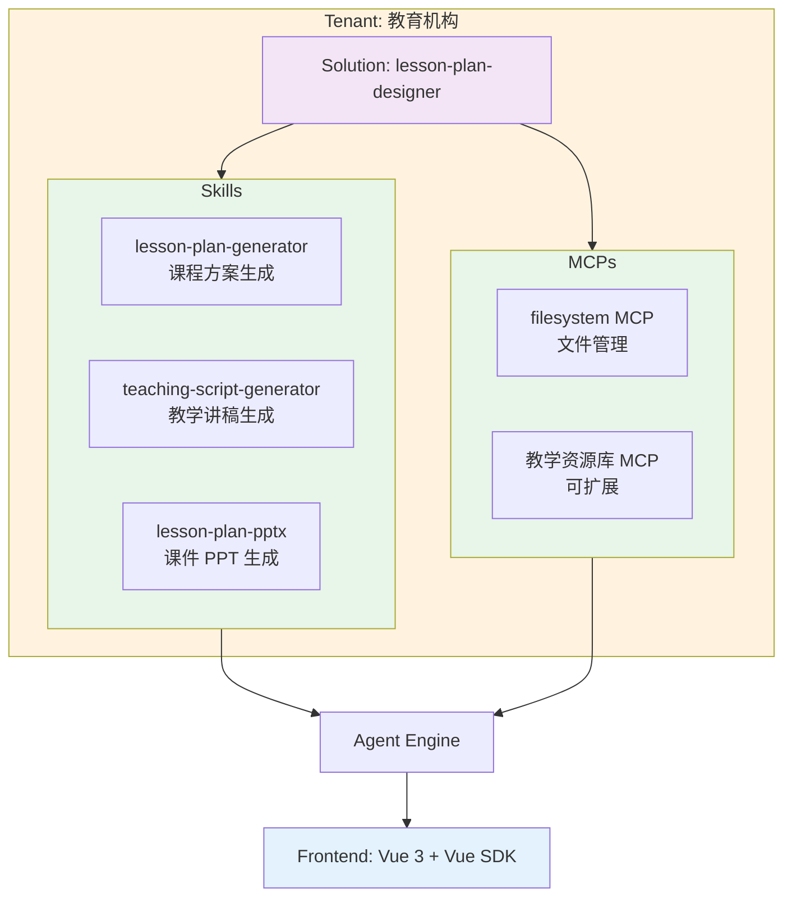

### 5.3 工作流程

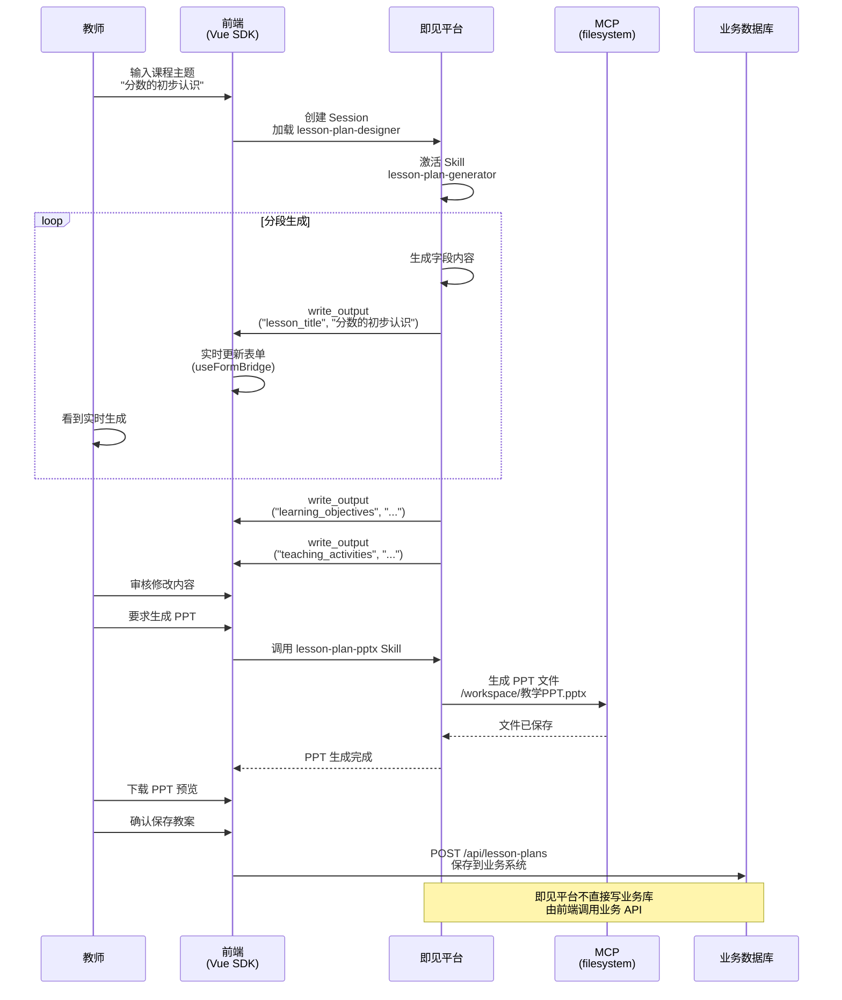

### 5.4 关键技术点

**1. 分段生成 + 实时同步**

Skill 使用 `write_output` 逐字段输出：
```yaml
prompt: |
  输出字段（使用 write_output）：
  - lesson_title: 课程标题
  - learning_objectives: 学习目标
  - teaching_activities: 教学活动

  重要：逐字段输出，方便前端实时同步
```

前端 Vue SDK 监听并更新：
```vue
<script setup>
import { useFormBridge } from '@kedge-agentic/vue-sdk'

const lessonPlan = reactive({
  lesson_title: '',
  learning_objectives: '',
  teaching_activities: ''
})

const formBridge = useFormBridge()
formBridge.registerForm('lessonPlan', lessonPlan, {
  fieldMapping: {
    'lesson_title': 'lesson_title',
    'learning_objectives': 'learning_objectives',
    'teaching_activities': 'teaching_activities'
  }
})

// AI 输出自动更新到 lessonPlan
</script>
```

**2. 文件管理（Session 文件系统）**

生成的 PPT 保存在 Session 的独立文件系统：
- 路径：`/workspace/教学PPT.pptx`
- 教师可以下载预览
- 可以关联到教案（调用业务 API）

**3. 用户控制权**

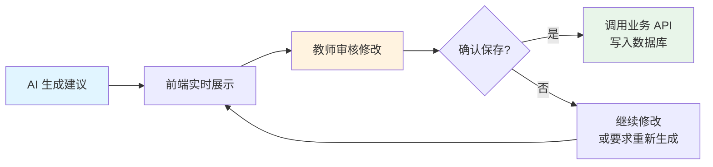

### 5.5 可复用的模式

| 模式 | lesson-plan-designer 实现 | 对您的启示 |
|------|-------------------------|-----------|
| **Tenant/Solution** | 教育机构租户 + 课程设计方案 | 您的租户空间 + 您的业务场景 |
| **分段生成** | write_output 逐字段输出 | 适合表单填充、报告生成 |
| **实时同步** | Vue SDK useFormBridge | 提升用户体验，所见即所得 |
| **只读 MCP** | filesystem MCP（可扩展教学资源库） | 您的知识库、数据库 MCP |
| **文件管理** | Session 文件系统存储 PPT | 适合文档生成、报表导出 |
| **用户确认** | 教师审核后前端调用 API 保存 | 用户掌控，安全可控 |

### 5.6 扩展方向（类似您的需求）

**当前实现**：
- MCP：文件系统
- Skills：课程生成、讲稿、PPT

**可扩展**（参考您的场景）：
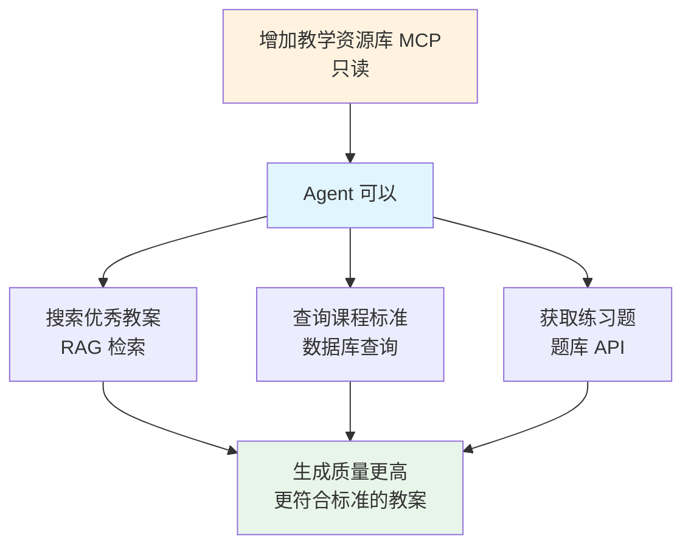

这与您的需求类似：
- 您的 RAG 系统 → 知识库 MCP
- 您的数据库 → 查询 MCP
- 您的业务 API → API MCP

---

## 第六部分：我们的建议与 Tips

### 6.1 MCP 开发要点

**1. 接口设计原则**

✅ **好的设计**：
```typescript
{
  name: "query_sales_data",
  description: "查询指定时间范围内的销售数据，支持按产品、地区、客户筛选",
  parameters: {
    startDate: "string (YYYY-MM-DD)",
    endDate: "string (YYYY-MM-DD)",
    groupBy: "enum [product, region, customer]",
    filters: "object (可选)"
  }
}
```

❌ **不好的设计**：
```typescript
{
  name: "get_data",  // 太泛化
  description: "获取数据",  // 描述不清晰
  parameters: {
    sql: "string"  // 不安全，暴露 SQL
  }
}
```

**2. 安全考虑**

- ✅ 参数化查询，防止注入
- ✅ 限制查询范围（时间窗口、数据量）
- ✅ 只读权限
- ✅ 超时控制
- ✅ 敏感数据脱敏

**3. 性能优化**

```typescript
// ✅ 支持分页
{
  name: "query_orders",
  parameters: {
    page: "number",
    pageSize: "number (max: 100)",
    // ...
  }
}

// ✅ 支持缓存
const cache = new Map()
handler: async (params) => {
  const cacheKey = JSON.stringify(params)
  if (cache.has(cacheKey)) {
    return cache.get(cacheKey)
  }
  // ... 查询逻辑
}

// ✅ 批量查询优化
{
  name: "batch_query_customers",
  parameters: {
    customerIds: "string[] (max: 50)"
  }
}
```

### 6.2 Skills 定义技巧

**1. 提示词结构**

```yaml
prompt: |
  # 角色定义
  你是 [具体角色]，专长于 [具体领域]。

  # 可用工具
  可用工具：
  - tool_name: 工具描述
  - tool_name2: 工具描述

  # 工作流程
  执行步骤：
  1. 理解需求
  2. 查询数据
  3. 分析处理
  4. 生成结果

  # 约束条件
  重要原则：
  - 只读取数据，不修改
  - 基于真实数据，不臆测
  - 返回结构化结果
  - 所有建议需用户确认

  # 输出格式
  输出要求：
  - 使用 write_output 逐字段输出
  - 返回 JSON 格式结果
  - 包含置信度和数据来源
```

**2. 工具组合策略**

```yaml
# 组合 1：查询 + 分析
mcpServers:
  - database-query    # 获取数据
  - knowledge-base    # 获取分析方法

# 组合 2：多数据源
mcpServers:
  - crm-system       # 客户数据
  - erp-system       # 订单数据
  - analytics-api    # 统计数据

# 组合 3：读 + 写文件
mcpServers:
  - filesystem       # 读取模板、写入结果
  - database-query   # 查询数据
```

### 6.3 前端集成建议

**1. 结果展示设计**

```vue
<template>
  <!-- AI 生成的内容 -->
  <div class="ai-generated">
    <div class="ai-badge">AI 生成</div>
    <div class="content">{{ aiContent }}</div>

    <!-- 用户可编辑 -->
    <textarea v-model="aiContent"></textarea>

    <!-- 操作按钮 -->
    <div class="actions">
      <button @click="regenerate">重新生成</button>
      <button @click="confirm">确认使用</button>
    </div>
  </div>
</template>
```

**2. 确认流程**

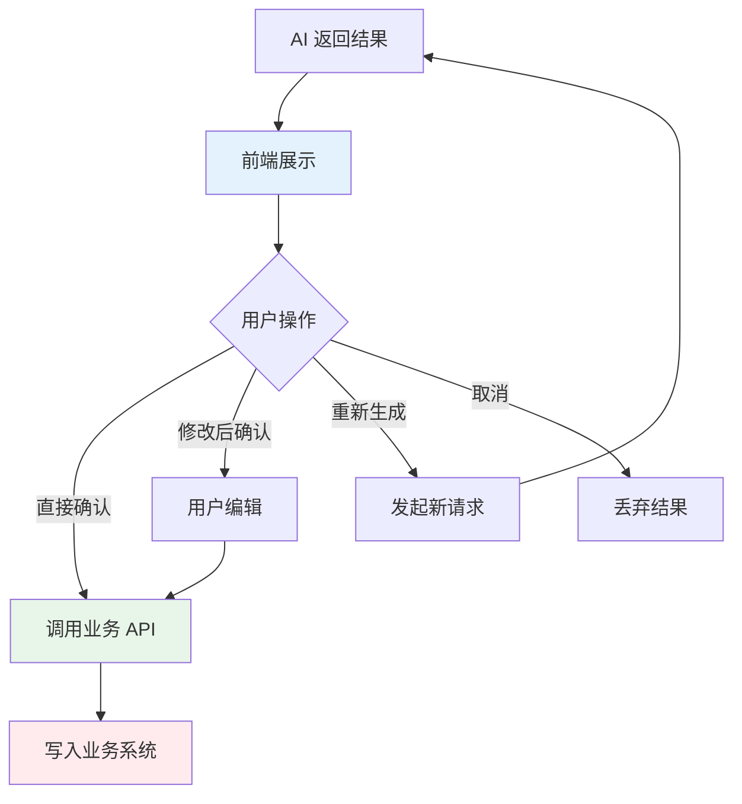

**3. 错误处理**

```typescript
try {
  const result = await agent.query(input)
  // 展示结果
} catch (error) {
  if (error.code === 'MCP_TIMEOUT') {
    // MCP 调用超时
    showError('数据查询超时，请稍后重试')
  } else if (error.code === 'MCP_ERROR') {
    // MCP 返回错误
    showError('数据查询失败：' + error.message)
  } else {
    // 其他错误
    showError('处理失败，请重试')
  }
}
```

**4. Context Sync（上下文同步）⭐ 重要**

**核心问题**：Agent 需要知道用户当前看到了什么

**为什么重要**：
- Agent 不会主动查看前端状态
- 如果 Agent 不知道用户已填写的内容，可能会：
  - 重复生成已有内容
  - 给出不相关的建议
  - 无法进行增量更新

**lesson-plan-designer 的解决方案**：

在 Skill 提示词中明确要求同步上下文：

```yaml
name: lesson-plan-generator
prompt: |
  你是课程设计专家。

  **重要**：用户会通过 contextSync 告诉你当前教案的状态。
  你必须：
  1. 首先理解用户已经填写的内容
  2. 基于现有内容进行增量生成或修改
  3. 不要重复生成已有的部分

  用户输入格式：
  ```
  [当前状态]
  lesson_title: 分数的初步认识
  grade_level: 三年级
  learning_objectives: (待生成)

  [用户请求]
  请帮我生成学习目标
  ```

  你的输出：
  - 只生成 learning_objectives
  - 使用 write_output("learning_objectives", "...")
  - 确保与已有内容协调一致
```

**前端实现**（示例）：

```typescript
// 用户发送消息时，自动附加当前表单状态
const sendMessageWithContext = (userMessage: string) => {
  const currentState = `
[当前教案状态]
课程标题: ${lessonPlan.lesson_title || '(未填写)'}
年级: ${lessonPlan.grade_level || '(未填写)'}
学习目标: ${lessonPlan.learning_objectives || '(未填写)'}
教学活动: ${lessonPlan.teaching_activities || '(未填写)'}

[用户请求]
${userMessage}
  `.trim()

  return agent.sendMessage(currentState)
}
```

**最佳实践**：

1. **自动同步**：每次用户发送消息时，前端自动附加当前状态

2. **结构化格式**：使用清晰的格式让 Agent 容易解析
   ```
   [当前状态]
   字段名: 值
   字段名: 值

   [用户请求]
   用户的问题或指令
   ```

3. **标记空字段**：明确哪些是待生成的
   ```
   learning_objectives: (待生成)
   assessment_methods: (待生成)
   ```

4. **增量更新**：Agent 只更新用户关心的部分
   ```
   用户："请优化学习目标"
   → Agent 只生成新的 learning_objectives
   ```

**未来改进**：

- **Tenant 级别配置**：支持在 Tenant 的 system prompt 中统一配置 contextSync 规则
- **自动化**：平台可能会提供自动的 context 注入机制
- **Session 持久化**：Session 可以记住历史状态，减少重复传输

**对你们的建议**：

在设计 Skill 时，务必考虑：
1. 用户的前端表单有哪些字段
2. Agent 如何知道这些字段的当前值
3. 在 Skill 提示词中明确 contextSync 的格式和要求

### 6.4 安全性考虑

**1. MCP 访问控制**

```yaml
# MCP Server 配置
security:
  authentication:
    type: api-key
    header: X-MCP-API-Key

  rateLimit:
    requests: 100
    period: 60  # seconds

  ipWhitelist:
    - 10.0.0.0/8  # 内网
```

**2. 数据脱敏**

```typescript
handler: async (params) => {
  const data = await db.query(params)

  // 脱敏处理
  return data.map(row => ({
    ...row,
    phone: maskPhone(row.phone),      // 138****5678
    email: maskEmail(row.email),      // a***@example.com
    idCard: maskIDCard(row.idCard)    // 110***********1234
  }))
}
```

**3. 审计日志**

```typescript
// 记录所有 MCP 调用
logger.info({
  timestamp: Date.now(),
  sessionId: session.id,
  userId: session.userId,
  tool: 'query_sales_data',
  parameters: params,
  result: { count: result.length },
  duration: elapsed
})
```

### 6.5 性能优化

**1. MCP 缓存策略**

```typescript
// 场景 1：静态数据缓存
const CACHE_TTL = 3600 * 1000  // 1 hour
cache.set(key, data, CACHE_TTL)

// 场景 2：用户会话缓存
sessionCache.set(sessionId, data)

// 场景 3：热数据预加载
await preloadCommonData()
```

**2. 批量操作**

```typescript
// ❌ 逐个查询
for (const id of ids) {
  const customer = await getCustomer(id)
}

// ✅ 批量查询
const customers = await batchGetCustomers(ids)
```

**3. 超时控制**

```typescript
{
  handler: async (params) => {
    const timeout = 10000  // 10 seconds

    return Promise.race([
      executeQuery(params),
      new Promise((_, reject) =>
        setTimeout(() => reject(new Error('Timeout')), timeout)
      )
    ])
  }
}
```

### 6.6 常见陷阱

❌ **陷阱 1**：描述不清晰
```typescript
// 不好
description: "获取数据"

// 好
description: "查询指定时间范围内的销售订单数据，包含订单号、金额、状态等信息"
```

❌ **陷阱 2**：参数太复杂
```typescript
// 不好
parameters: {
  query: "复杂的 JSON 对象"
}

// 好
parameters: {
  startDate: "string",
  endDate: "string",
  productId: "string (optional)",
  status: "enum [pending, completed, cancelled]"
}
```

❌ **陷阱 3**：返回数据过大
```typescript
// 不好
return await db.query("SELECT * FROM orders")  // 可能上万条

// 好
return await db.query("SELECT * FROM orders LIMIT 100")
```

❌ **陷阱 4**：暴露敏感信息
```typescript
// 不好
return { password: user.password, ... }

// 好
const { password, ...safeUser } = user
return safeUser
```

---

## 总结

### 核心理念

🎯 **即见平台 = Agentic AI 能力层**

- 我们提供 AI 能力
- 您保留业务控制
- 用户掌握最终决策

### 关键技术

1. **Tenant/Solution 架构** - 清晰的层级和隔离
2. **MCP 标准接口** - 打通 Legacy 系统
3. **只读 + 确认模式** - 安全可控
4. **Session 隔离** - 多用户并发

### 实施路径

**阶段 1：POC 验证**
- 选择一个简单场景
- 开发 1-2 个 MCP Server
- 定义 1 个核心 Skill
- 前端简单集成

**阶段 2：功能扩展**
- 增加更多 MCP
- 开发更多 Skills
- 完善前端交互

**阶段 3：优化迭代**
- 性能优化
- 用户体验
- 扩展新场景

### 下一步行动

1. **技术对接会议** - 深入讨论技术细节
2. **MCP 接口设计** - 确定暴露哪些能力
3. **POC 规划** - 选择试点场景
4. **开发排期** - 制定实施计划

---

## 附录：技术术语表

| 术语 | 英文 | 说明 |
|------|------|------|
| 即见平台 | CCAAS | Agentic AI 基础设施平台 |
| 租户 | Tenant | 独立的客户空间，完全隔离 |
| 解决方案 | Solution | 特定场景的 AI 能力包（Skills + MCPs） |
| 技能 | Skill | AI 的角色定义和工作流程 |
| 模型上下文协议 | MCP | Model Context Protocol，标准化工具接口 |
| 会话 | Session | 单次用户交互的独立环境 |
| 代理 | Agent | 自主决策和执行的 AI 系统 |
| 遗留系统 | Legacy System | 已有的老系统 |

---

**文档版本**：v1.0
**更新日期**：2026-02-09
**联系方式**：[您的技术团队联系方式]
