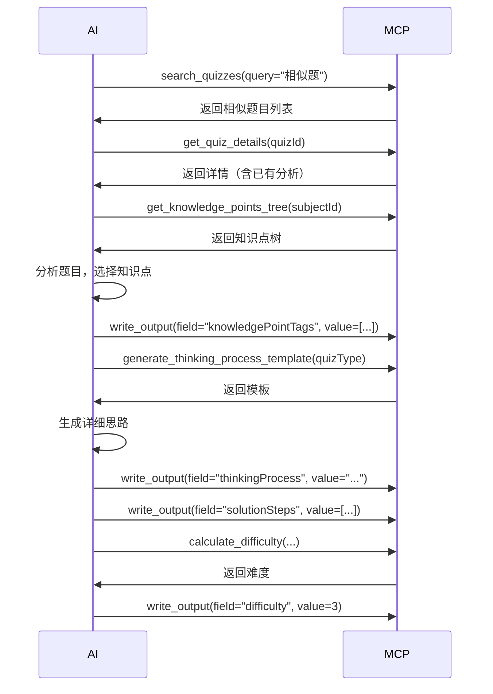

# Quiz Analyzer MCP Server 文档

## 概述

Quiz Analyzer MCP (Model Context Protocol) Server 是一个 REST API 服务，为 AI 提供教育题目分析所需的工具集。

- **端口**: 3006 (可配置)
- **协议**: HTTP REST API
- **数据格式**: JSON
- **数据库**: SQLite3

## 目录

- [快速开始](#快速开始)
- [工具列表](#工具列表)
- [数据分析工具](#数据分析工具)
- [搜索工具](#搜索工具)
- [数据结构](#数据结构)
- [错误处理](#错误处理)
- [使用场景](#使用场景)
- [最佳实践](#最佳实践)

---

## 快速开始

### 安装依赖

```bash
npm install
```

### 启动服务器

```bash
# 开发模式
npm run dev

# 生产模式
npm run build
npm start

# 自定义端口
MCP_PORT=3007 npm start
```

### 健康检查

```bash
curl http://localhost:3006/health
```

**响应**:
```json
{
  "status": "healthy",
  "service": "quiz-analyzer-mcp",
  "version": "1.0.0",
  "timestamp": "2026-02-06T08:00:00.000Z",
  "knowledgePoints": 8
}
```

---

## 工具列表

| 工具名称 | 类型 | 用途 |
|---------|------|------|
| [write_output](#write_output) | 数据写入 | 存储分析结果到 SYNC_FIELDS |
| [get_knowledge_points_tree](#get_knowledge_points_tree) | 数据查询 | 获取分层知识点树 |
| [verify_knowledge_point_tags](#verify_knowledge_point_tags) | AI辅助 | 验证知识点标签 |
| [calculate_difficulty](#calculate_difficulty) | 计算 | 计算题目难度 |
| [generate_thinking_process_template](#generate_thinking_process_template) | 生成 | 生成解题思路模板 |
| [search_quizzes](#search_quizzes) | 搜索 | 多条件搜索题目 |
| [search_knowledge_points](#search_knowledge_points) | 搜索 | 搜索知识点 |
| [get_quiz_details](#get_quiz_details) | 查询 | 获取题目完整详情 |

---

## 数据分析工具

### write_output

存储分析结果到同步字段。

**端点**: `POST /tools/write_output`

**请求参数**:
```typescript
{
  field: SyncField;     // 字段名（必须是有效的 SYNC_FIELD）
  value: unknown;       // 字段值（会进行 Zod 验证）
  preview?: string;     // 预览文本（可选）
}
```

**SYNC_FIELDS 列表**:
- `quizAnalysis` - 整体分析总结 (string, Markdown)
- `knowledgePointTags` - 知识点标签数组 (KnowledgePointTag[])
- `thinkingProcess` - 解题思路 (string, Markdown)
- `solutionSteps` - 解题步骤数组 (SolutionStep[])
- `correctAnswer` - 正确答案 (string)
- `commonMistakes` - 常见错误数组 (Mistake[])
- `knowledgeGapAnalysis` - 知识盲点分析 (string, Markdown)
- `difficulty` - 难度等级 (number, 1-5)
- `relatedQuizzes` - 相关题目数组 (RelatedQuiz[])
- `timeEstimate` - 预计用时 (string)

**示例 1: 存储解题思路**

```bash
curl -X POST http://localhost:3006/tools/write_output \
  -H "Content-Type: application/json" \
  -d '{
    "field": "thinkingProcess",
    "value": "# 解题思路\n\n## 1. 审题\n理解题目条件...\n\n## 2. 制定策略\n选择因式分解法...",
    "preview": "已更新解题思路"
  }'
```

**成功响应**:
```json
{
  "status": "success",
  "data": {
    "field": "thinkingProcess",
    "value": "# 解题思路\n\n## 1. 审题...",
    "preview": "已更新解题思路"
  }
}
```

**示例 2: 存储知识点标签**

```bash
curl -X POST http://localhost:3006/tools/write_output \
  -H "Content-Type: application/json" \
  -d '{
    "field": "knowledgePointTags",
    "value": [
      {
        "id": "kp-001",
        "name": "一元二次方程",
        "confidence": 0.95,
        "verified": true,
        "level": 2,
        "path": ["代数", "方程", "一元二次方程"]
      }
    ]
  }'
```

**示例 3: 存储解题步骤**

```bash
curl -X POST http://localhost:3006/tools/write_output \
  -H "Content-Type: application/json" \
  -d '{
    "field": "solutionSteps",
    "value": [
      {
        "stepNumber": 1,
        "title": "因式分解",
        "description": "将方程 x² - 5x + 6 分解为 (x-2)(x-3) = 0",
        "formula": "(x-2)(x-3) = 0",
        "reasoning": "6 = 2×3，且 2+3 = 5",
        "commonErrors": ["符号错误：(x+2)(x+3)"]
      },
      {
        "stepNumber": 2,
        "title": "求解",
        "description": "令每个因式为0",
        "reasoning": "零因子性质",
        "commonErrors": ["只求出一个根"]
      }
    ]
  }'
```

**错误响应**:
```json
{
  "status": "error",
  "error": "Invalid field: wrongField. Must be one of: quizAnalysis, knowledgePointTags, ...",
  "field": "wrongField"
}
```

```json
{
  "status": "error",
  "error": "Validation failed: confidence: Number must be less than or equal to 1",
  "field": "knowledgePointTags"
}
```

---

### get_knowledge_points_tree

获取分层的知识点树结构。

**端点**: `POST /tools/get_knowledge_points_tree`

**请求参数**:
```typescript
{
  subjectId: string;      // 科目ID
  gradeLevel?: string;    // 年级（可选，用于过滤）
}
```

**示例**:

```bash
curl -X POST http://localhost:3006/tools/get_knowledge_points_tree \
  -H "Content-Type: application/json" \
  -d '{
    "subjectId": "b0138cae-9867-4fb9-b96b-d69e6aeaee4f",
    "gradeLevel": "9"
  }'
```

**响应**:
```json
{
  "status": "success",
  "data": {
    "tree": [
      {
        "id": "kp-001",
        "name": "代数",
        "code": null,
        "level": 0,
        "gradeLevel": "7",
        "children": [
          {
            "id": "kp-002",
            "name": "方程",
            "level": 1,
            "gradeLevel": "8",
            "children": [
              {
                "id": "kp-003",
                "name": "一元二次方程",
                "level": 2,
                "gradeLevel": "9",
                "children": []
              }
            ]
          }
        ]
      }
    ],
    "totalNodes": 3
  }
}
```

**使用场景**:
- AI 分析题目前，了解可用的知识点
- 让 AI 选择合适的知识点标签
- 构建知识点导航菜单

---

### verify_knowledge_point_tags

验证 AI 提议的知识点标签是否准确。

**端点**: `POST /tools/verify_knowledge_point_tags`

**请求参数**:
```typescript
{
  quizContent: string;               // 题目内容
  proposedTags: KnowledgePointTag[]; // 建议的标签
}
```

**示例**:

```bash
curl -X POST http://localhost:3006/tools/verify_knowledge_point_tags \
  -H "Content-Type: application/json" \
  -d '{
    "quizContent": "求解方程 x² + 3x + 2 = 0",
    "proposedTags": [
      {
        "id": "kp-003",
        "name": "一元二次方程",
        "confidence": 0.90
      }
    ]
  }'
```

**响应**:
```json
{
  "status": "success",
  "data": {
    "instructions": "Analyze the quiz content and verify each proposed knowledge point tag. For each tag, determine if it's relevant (confidence 0.0-1.0) and mark as verified.",
    "availableKnowledgePoints": {
      "math-id": [
        {
          "id": "kp-001",
          "name": "代数",
          "children": [...]
        }
      ]
    }
  }
}
```

**AI 使用方法**:
1. 调用此工具获取可用知识点
2. 分析题目内容
3. 为每个标签设置置信度 (0.0-1.0)
4. 设置 verified = true/false
5. 使用 write_output 存储验证后的标签

---

### calculate_difficulty

根据知识点数量和解题步骤计算题目难度。

**端点**: `POST /tools/calculate_difficulty`

**请求参数**:
```typescript
{
  knowledgePointCount: number;  // 涉及的知识点数量
  stepCount: number;            // 解题步骤数量
  quizType: string;             // 题型
}
```

**题型权重**:
- 选择题: 0.8
- 填空题: 1.0
- 解答题: 1.2
- 证明题: 1.5

**计算公式**:
```
难度 = min(5, ceil((知识点数 × 0.5 + 步骤数 × 0.3) × 题型权重))
```

**示例**:

```bash
curl -X POST http://localhost:3006/tools/calculate_difficulty \
  -H "Content-Type: application/json" \
  -d '{
    "knowledgePointCount": 3,
    "stepCount": 5,
    "quizType": "解答题"
  }'
```

**响应**:
```json
{
  "status": "success",
  "data": {
    "difficulty": 4,
    "label": "较难",
    "timeEstimate": "12-18分钟",
    "formula": "min(5, ceil((3 × 0.5 + 5 × 0.3) × 1.2))"
  }
}
```

**难度等级**:
1. 简单 (3-5分钟)
2. 较易 (5-8分钟)
3. 中等 (8-12分钟)
4. 较难 (12-18分钟)
5. 困难 (18分钟以上)

---

### generate_thinking_process_template

根据题型生成解题思路模板。

**端点**: `POST /tools/generate_thinking_process_template`

**请求参数**:
```typescript
{
  quizContent?: string;      // 题目内容（可选）
  quizType: string;          // 题型
  knowledgePoints?: string[]; // 知识点名称数组（可选）
}
```

**示例**:

```bash
curl -X POST http://localhost:3006/tools/generate_thinking_process_template \
  -H "Content-Type: application/json" \
  -d '{
    "quizType": "解答题",
    "knowledgePoints": ["一元二次方程", "因式分解"]
  }'
```

**响应**:
```json
{
  "status": "success",
  "data": {
    "template": "# 解题思路\n\n## 1. 审题\n- 理解题目条件\n- 明确求解目标\n- 识别隐含条件\n\n## 2. 制定策略\n相关知识点：一元二次方程, 因式分解\n- 选择合适方法\n- 规划解题步骤\n\n## 3. 详细求解\n[AI将在这里生成具体步骤]\n\n## 4. 检验\n- 验证结果合理性\n- 检查计算过程",
    "instructions": "Use this template as a starting point. Fill in specific details based on the quiz content."
  }
}
```

**支持的题型**:
- 选择题
- 解答题
- 填空题
- 证明题

---

## 搜索工具

### search_quizzes

多条件搜索题目。

**端点**: `POST /tools/search_quizzes`

**请求参数**:
```typescript
{
  query?: string;           // 关键词（搜索题目内容）
  subjectId?: string;       // 科目ID
  gradeLevel?: string;      // 年级
  quizType?: string;        // 题型
  difficulty?: number;      // 难度 (1-5)
  knowledgePointId?: string; // 知识点ID
  limit?: number;           // 返回数量（默认10，最大250）
  offset?: number;          // 偏移量（默认0）
}
```

**示例 1: 关键词搜索**

```bash
curl -X POST http://localhost:3006/tools/search_quizzes \
  -H "Content-Type: application/json" \
  -d '{
    "query": "方程",
    "limit": 3
  }'
```

**响应**:
```json
{
  "status": "success",
  "data": {
    "quizzes": [
      {
        "id": "quiz-001",
        "content": "求解方程 x² - 5x + 6 = 0",
        "quiz_type": "解答题",
        "difficulty": 3,
        "grade_level": "9",
        "correct_answer": "x₁ = 2, x₂ = 3",
        "subject_name": "数学",
        "knowledge_points": "一元二次方程"
      },
      {
        "id": "quiz-002",
        "content": "解方程：2x + 5 = 11",
        "quiz_type": "解答题",
        "difficulty": 1,
        "grade_level": "7",
        "correct_answer": "x = 3",
        "subject_name": "数学",
        "knowledge_points": "一元一次方程"
      }
    ],
    "pagination": {
      "total": 4,
      "limit": 3,
      "offset": 0,
      "hasMore": true
    }
  }
}
```

**示例 2: 多条件组合**

```bash
curl -X POST http://localhost:3006/tools/search_quizzes \
  -H "Content-Type: application/json" \
  -d '{
    "subjectId": "math-id",
    "gradeLevel": "9",
    "difficulty": 3,
    "quizType": "解答题",
    "limit": 10,
    "offset": 0
  }'
```

**示例 3: 按知识点搜索**

```bash
curl -X POST http://localhost:3006/tools/search_quizzes \
  -H "Content-Type: application/json" \
  -d '{
    "knowledgePointId": "kp-003",
    "difficulty": 2
  }'
```

**使用场景**:
- 查找相似题目
- 按难度筛选练习题
- 按知识点组卷
- 题库管理

---

### search_knowledge_points

搜索知识点，支持树形导航。

**端点**: `POST /tools/search_knowledge_points`

**请求参数**:
```typescript
{
  query?: string;        // 关键词（搜索知识点名称）
  subjectId?: string;    // 科目ID
  gradeLevel?: string;   // 年级
  parentId?: string | null; // 父知识点ID（null表示只搜索根节点）
  limit?: number;        // 返回数量（默认20）
}
```

**示例 1: 关键词搜索**

```bash
curl -X POST http://localhost:3006/tools/search_knowledge_points \
  -H "Content-Type: application/json" \
  -d '{
    "query": "方程"
  }'
```

**响应**:
```json
{
  "status": "success",
  "data": {
    "knowledgePoints": [
      {
        "id": "kp-002",
        "name": "方程",
        "code": null,
        "level": 1,
        "grade_level": "8",
        "parent_id": "kp-001",
        "subject_name": "数学",
        "parent_name": "代数",
        "children_count": 2
      },
      {
        "id": "kp-003",
        "name": "一元二次方程",
        "code": null,
        "level": 2,
        "grade_level": "9",
        "parent_id": "kp-002",
        "subject_name": "数学",
        "parent_name": "方程",
        "children_count": 0
      }
    ],
    "count": 2
  }
}
```

**示例 2: 获取根节点**

```bash
curl -X POST http://localhost:3006/tools/search_knowledge_points \
  -H "Content-Type: application/json" \
  -d '{
    "parentId": null
  }'
```

**响应**:
```json
{
  "status": "success",
  "data": {
    "knowledgePoints": [
      {
        "id": "kp-001",
        "name": "代数",
        "level": 0,
        "parent_id": null,
        "subject_name": "数学",
        "parent_name": null,
        "children_count": 1
      },
      {
        "id": "kp-010",
        "name": "几何",
        "level": 0,
        "parent_id": null,
        "subject_name": "数学",
        "parent_name": null,
        "children_count": 3
      }
    ],
    "count": 2
  }
}
```

**示例 3: 获取子节点**

```bash
curl -X POST http://localhost:3006/tools/search_knowledge_points \
  -H "Content-Type: application/json" \
  -d '{
    "parentId": "kp-001"
  }'
```

**使用场景**:
- 树形导航
- 知识点选择器
- 知识图谱展示
- 学习路径规划

---

### get_quiz_details

获取题目的完整详情，包括知识点和分析数据。

**端点**: `POST /tools/get_quiz_details`

**请求参数**:
```typescript
{
  quizId: string;  // 题目ID（必填）
}
```

**示例**:

```bash
curl -X POST http://localhost:3006/tools/get_quiz_details \
  -H "Content-Type: application/json" \
  -d '{
    "quizId": "quiz-001"
  }'
```

**响应**:
```json
{
  "status": "success",
  "data": {
    "quiz": {
      "id": "quiz-001",
      "tenant_id": "default",
      "content": "求解方程 x² - 5x + 6 = 0",
      "content_html": null,
      "image_urls": null,
      "subject_id": "math-id",
      "grade_level": "9",
      "quiz_type": "解答题",
      "difficulty": 3,
      "source": null,
      "chapter_reference": null,
      "correct_answer": "x₁ = 2, x₂ = 3",
      "answer_options": null,
      "created_at": "2026-02-05 16:51:20",
      "updated_at": "2026-02-05 16:51:20",
      "subject_name": "数学",
      "subject_code": "MATH"
    },
    "knowledgePoints": [
      {
        "id": "kp-003",
        "name": "一元二次方程",
        "code": null,
        "level": 2,
        "confidence_score": 1.0,
        "link_type": "manual"
      }
    ],
    "analysis": {
      "id": "analysis-001",
      "quiz_id": "quiz-001",
      "thinking_process": "# 解题思路\n\n## 1. 审题\n方程 x² - 5x + 6 = 0 是标准的一元二次方程形式\n\n## 2. 选择方法\n可以使用因式分解法，因为常数项6可以分解为2×3，且2+3=5\n\n## 3. 求解\n将方程因式分解为 (x-2)(x-3) = 0\n因此 x₁ = 2, x₂ = 3\n\n## 4. 检验\n代入原方程验证，确认答案正确",
      "solution_steps": "[{\"stepNumber\":1,\"title\":\"因式分解\",...}]",
      "common_mistakes": "[{\"description\":\"符号错误\",...}]",
      "knowledge_gap_analysis": "学生需要掌握：1) 一元二次方程的标准形式；2) 因式分解法；3) 十字相乘法",
      "difficulty_rationale": "该题涉及一元二次方程的基本解法，属于中等难度",
      "time_estimate": "5-8分钟",
      "analyzed_at": "2026-02-05 16:51:20",
      "analyzer_version": "1.0",
      "analysis_duration_ms": null
    }
  }
}
```

**没有分析数据时**:
```json
{
  "status": "success",
  "data": {
    "quiz": {...},
    "knowledgePoints": [...],
    "analysis": null
  }
}
```

**使用场景**:
- 展示题目详情页
- AI 分析前获取上下文
- 学生查看解题思路
- 教师备课

---

## 数据结构

### KnowledgePointTag

```typescript
interface KnowledgePointTag {
  id: string;              // 知识点ID
  name: string;            // 知识点名称
  confidence: number;      // 置信度 0.0-1.0
  verified: boolean;       // 是否已验证
  level: number;           // 树层级
  path: string[];          // 路径 ["代数", "方程", "一元二次方程"]
}
```

### SolutionStep

```typescript
interface SolutionStep {
  stepNumber: number;      // 步骤序号
  title: string;           // 步骤标题
  description: string;     // 步骤描述
  formula?: string;        // 公式（可选）
  reasoning: string;       // 推理过程
  commonErrors: string[];  // 常见错误
}
```

### Mistake

```typescript
interface Mistake {
  description: string;     // 错误描述
  frequency: 'high' | 'medium' | 'low';  // 频率
  knowledgeGaps: string[]; // 相关知识盲点（知识点ID）
  remediation: string;     // 补救措施
}
```

### RelatedQuiz

```typescript
interface RelatedQuiz {
  id: string;              // 题目ID
  content: string;         // 题目内容
  similarity: number;      // 相似度 0.0-1.0
  sharedKnowledgePoints: string[]; // 共同知识点ID
}
```

---

## 错误处理

### 标准错误响应

```json
{
  "status": "error",
  "error": "错误描述信息"
}
```

### 常见错误

**400 Bad Request - 参数错误**
```json
{
  "status": "error",
  "error": "Invalid field: wrongField. Must be one of: quizAnalysis, knowledgePointTags, ..."
}
```

**400 Bad Request - 验证失败**
```json
{
  "status": "error",
  "error": "Validation failed: confidence: Number must be less than or equal to 1",
  "field": "knowledgePointTags"
}
```

**404 Not Found - 资源不存在**
```json
{
  "status": "error",
  "error": "Quiz not found"
}
```

**500 Internal Server Error - 服务器错误**
```json
{
  "status": "error",
  "error": "Database connection failed"
}
```

---

## 使用场景

### 场景 1: AI 分析新题目



**代码示例**:

```javascript
// 1. 搜索相似题目
const similar = await fetch('/tools/search_quizzes', {
  method: 'POST',
  body: JSON.stringify({ query: "一元二次方程", limit: 5 })
});

// 2. 获取知识点树
const tree = await fetch('/tools/get_knowledge_points_tree', {
  method: 'POST',
  body: JSON.stringify({ subjectId: "math-id" })
});

// 3. 存储知识点标签
await fetch('/tools/write_output', {
  method: 'POST',
  body: JSON.stringify({
    field: "knowledgePointTags",
    value: [
      {
        id: "kp-003",
        name: "一元二次方程",
        confidence: 0.95,
        verified: true,
        level: 2,
        path: ["代数", "方程", "一元二次方程"]
      }
    ]
  })
});

// 4. 生成思路模板
const template = await fetch('/tools/generate_thinking_process_template', {
  method: 'POST',
  body: JSON.stringify({
    quizType: "解答题",
    knowledgePoints: ["一元二次方程"]
  })
});

// 5. 存储思路
await fetch('/tools/write_output', {
  method: 'POST',
  body: JSON.stringify({
    field: "thinkingProcess",
    value: "# 解题思路\n\n..."
  })
});

// 6. 计算难度
const difficulty = await fetch('/tools/calculate_difficulty', {
  method: 'POST',
  body: JSON.stringify({
    knowledgePointCount: 1,
    stepCount: 4,
    quizType: "解答题"
  })
});

// 7. 存储难度
await fetch('/tools/write_output', {
  method: 'POST',
  body: JSON.stringify({
    field: "difficulty",
    value: difficulty.data.difficulty
  })
});
```

---

### 场景 2: 学生练习

```javascript
// 1. 搜索知识点
const kps = await fetch('/tools/search_knowledge_points', {
  method: 'POST',
  body: JSON.stringify({ query: "三角形" })
});

const kpId = kps.data.knowledgePoints[0].id;

// 2. 查找相关题目
const quizzes = await fetch('/tools/search_quizzes', {
  method: 'POST',
  body: JSON.stringify({
    knowledgePointId: kpId,
    difficulty: 2,
    limit: 10
  })
});

// 3. 获取题目详情
const quizId = quizzes.data.quizzes[0].id;
const details = await fetch('/tools/get_quiz_details', {
  method: 'POST',
  body: JSON.stringify({ quizId })
});

// 展示：题目、知识点、解题思路、常见错误
```

---

### 场景 3: 教师组卷

```javascript
// 1. 多条件筛选题目
const quizzes = await fetch('/tools/search_quizzes', {
  method: 'POST',
  body: JSON.stringify({
    subjectId: "math-id",
    gradeLevel: "9",
    quizType: "解答题",
    difficulty: 3,
    limit: 20
  })
});

// 2. 批量获取详情
const details = await Promise.all(
  quizzes.data.quizzes.map(q =>
    fetch('/tools/get_quiz_details', {
      method: 'POST',
      body: JSON.stringify({ quizId: q.id })
    })
  )
);

// 3. 统计知识点分布
const kpDistribution = {};
details.forEach(d => {
  d.data.knowledgePoints.forEach(kp => {
    kpDistribution[kp.name] = (kpDistribution[kp.name] || 0) + 1;
  });
});

// 4. 生成试卷
```

---

## 最佳实践

### 1. 知识点标签验证

**推荐流程**:
```javascript
// 1. 获取知识点树
const tree = await getKnowledgePointsTree(subjectId);

// 2. AI 分析题目内容，提议标签
const proposedTags = aiAnalyze(quizContent, tree);

// 3. 调用验证工具获取上下文
const verification = await verifyKnowledgePointTags(quizContent, proposedTags);

// 4. AI 验证每个标签，调整置信度
const verifiedTags = proposedTags.map(tag => ({
  ...tag,
  confidence: aiVerify(tag, quizContent, verification.data.availableKnowledgePoints),
  verified: true
}));

// 5. 存储验证后的标签
await writeOutput('knowledgePointTags', verifiedTags);
```

### 2. 难度计算

**推荐步骤**:
```javascript
// 1. 分析知识点
const knowledgePoints = identifyKnowledgePoints(quizContent);

// 2. 生成解题步骤
const steps = generateSolutionSteps(quizContent, knowledgePoints);

// 3. 计算难度
const result = await calculateDifficulty({
  knowledgePointCount: knowledgePoints.length,
  stepCount: steps.length,
  quizType: quiz.type
});

// 4. 存储
await writeOutput('difficulty', result.data.difficulty);
await writeOutput('timeEstimate', result.data.timeEstimate);
```

### 3. 搜索优化

**关键词搜索**:
- 使用具体的数学术语："一元二次方程" 比 "方程" 更精确
- 组合多个条件：`query + gradeLevel + difficulty`

**分页处理**:
```javascript
let offset = 0;
const limit = 10;
let hasMore = true;

while (hasMore) {
  const result = await searchQuizzes({ query: "方程", limit, offset });

  // 处理结果
  processQuizzes(result.data.quizzes);

  hasMore = result.data.pagination.hasMore;
  offset += limit;
}
```

### 4. 错误处理

```javascript
async function safeWriteOutput(field, value) {
  try {
    const response = await fetch('/tools/write_output', {
      method: 'POST',
      body: JSON.stringify({ field, value })
    });

    const data = await response.json();

    if (data.status === 'error') {
      console.error(`写入失败: ${data.error}`);
      // 尝试修复并重试
      const fixed = fixValidationErrors(field, value, data.error);
      return await safeWriteOutput(field, fixed);
    }

    return data;
  } catch (error) {
    console.error(`请求失败:`, error);
    throw error;
  }
}
```

### 5. 批量操作

```javascript
// 批量获取详情
async function batchGetDetails(quizIds) {
  const batchSize = 10;
  const results = [];

  for (let i = 0; i < quizIds.length; i += batchSize) {
    const batch = quizIds.slice(i, i + batchSize);
    const promises = batch.map(id =>
      fetch('/tools/get_quiz_details', {
        method: 'POST',
        body: JSON.stringify({ quizId: id })
      })
    );

    const batchResults = await Promise.all(promises);
    results.push(...batchResults);

    // 避免压垮服务器
    await sleep(100);
  }

  return results;
}
```

---

## 性能建议

### 响应时间

| 工具 | 平均响应时间 | 说明 |
|------|-------------|------|
| write_output | ~2ms | 仅验证，不写数据库 |
| get_knowledge_points_tree | ~2ms | 内存缓存 |
| search_quizzes | ~5ms | 带索引的SQL查询 |
| search_knowledge_points | ~3ms | 简单查询 |
| get_quiz_details | ~4ms | 多表JOIN |
| calculate_difficulty | <1ms | 纯计算 |

### 优化建议

1. **缓存知识点树**: 启动时加载，避免重复查询
2. **使用分页**: 限制每次返回数量
3. **批量操作**: 合并多个请求
4. **添加索引**: 所有查询字段都有索引

---

## 开发指南

### 添加新工具

1. 在 `src/index.ts` 添加端点
2. 在 `src/types.ts` 添加类型定义
3. 更新 `solution.json` 的 `allowedTools`
4. 添加测试
5. 更新此文档

### 添加新 SYNC_FIELD

1. 更新 `src/types.ts` 的 `SYNC_FIELDS`
2. 添加 TypeScript 接口
3. 在 `src/schemas.ts` 添加 Zod schema
4. 更新数据库 schema (如需要)
5. 更新此文档

### 运行测试

```bash
# 启动服务器
npm start

# 另一个终端，运行测试
npm test
```

---

## 故障排查

### 端口被占用

```bash
# 查找占用端口的进程
lsof -ti:3006

# 杀死进程
lsof -ti:3006 | xargs kill -9

# 或使用不同端口
MCP_PORT=3007 npm start
```

### 数据库连接失败

```bash
# 检查数据库文件
ls -l ../../data/quiz-analyzer.db

# 重新创建数据库
cd ../../scripts
node import-excel-to-db.js
```

### 知识点树为空

```bash
# 检查数据
sqlite3 ../../data/quiz-analyzer.db "SELECT COUNT(*) FROM knowledge_points"

# 重启服务器重新加载
```

---

## 相关文档

- [项目 README](../README.md)
- [快速开始](../QUICKSTART.md)
- [开发指南](../CLAUDE.md)
- [测试结果](../MCP_TEST_RESULTS.md)
- [实现状态](../IMPLEMENTATION_STATUS.md)

---

## 支持

如有问题，请查看：
- GitHub Issues
- 项目文档
- 测试示例

---

**版本**: 1.0.0
**最后更新**: 2026-02-06
